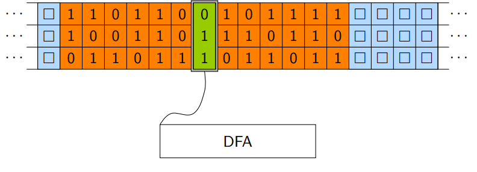

# Berechenbarkeit und Komplexität

:::info
Zentrale Fragen:

- Welche Probleme sind mit einem Algorithmus lösbar?
- Welche Sprachen können durch einen Algorithmus entschieden werden?

:::

## Definitionen "Problem"

1. Relation: $R \subseteq \Sigma^* \times \Sigma^{`*}$
2. Funktion: $f: \Sigma^* \rarr \Sigma^{`*}$ (Vorraussetzung: eindeutige Lösung)
3. **Sprache**: Für Entscheidungsprobleme (Ja $\lrArr$ Wort in Sprache)

## Die Turing-Maschine ("TM")

:::info
**Turing-Mächtigkeit**: Moderne Computer sind genau turing-mächtig. Das heißt, jede Aufgabe, die von einem PC gelöst werden kann, kann von einer TM gelöst werden. Umgekehrt kann ein PC nichts lösen, was eine TM nicht lösen kann.
:::

### Definition

- $Q$: Endliche Zustandsmenge
- $\Sigma$: Endliches Eingabealphabet
- $\Gamma \supset \Sigma$: Bandalphabet
- $B \in \Gamma \backslash \Sigma$: Leerzeichen
- $q_0 \in Q$: Startzustand
- $\bar{q} \in Q$: Endzustand
- $\delta : (Q \backslash \{\bar{q}\}) \times \Gamma \rarr Q \times \Gamma \times \{R,L,N\}$: Übergangsfunktion  
  ($\{R,L,N\}$: Bewegung des Kopfes)

### Bemerkungen

- Band ist durchnummeriert: 0 = $q_0$, <0 links, >0 rechts
- Ausgabewort beginnt bei Position des Kopfes, endet direkt vor erstem Symbol $\notin \Sigma$
- $L(M)$: Alle von $T$ akzeptierten Worte (Wort beginnt mit 1 $\lrArr$ akzeptiert)

:::info
**Laufzeit**: Anzahl der nötigen Schritte  
**Speicherbedarf**: Anzahl benötigter Zellen auf dem Speicherband
:::

### Konfiguration

- Der aktuelle Zustand der TM
- Definiert durch den String $\alpha q \beta$
  - $\alpha$: Band vor dem Kopf
  - $q$: Aktueller Zustand
  - $\beta$: Band unter und nach Kopf
- $\alpha q \beta  \vdash \alpha^` q^` \beta^`$: Direkter Nachfolger
- $\alpha q \beta  \vdash^* \alpha^{``} q^{``} \beta^{``}$: Indirekter Nachfolger

## Erweiterungen der Turing-Maschine

### Speicher im Zustandsraum

Idee: Speichere die letzten $k$ gelesenen Zeichen aus dem Band in den Zuständen

### Mehrspurige Maschinen

- Konstruiert durch Vektoren im Bandalphabet
- Darstellbar sind:
  - Variablen: 1 Band pro Variable
  - Arrays: 1 Band pro Array, Trennzeichen zwischen Einträgen
  - Unterprogramme: Spur als Prozedurstack (rekursion möglich)
